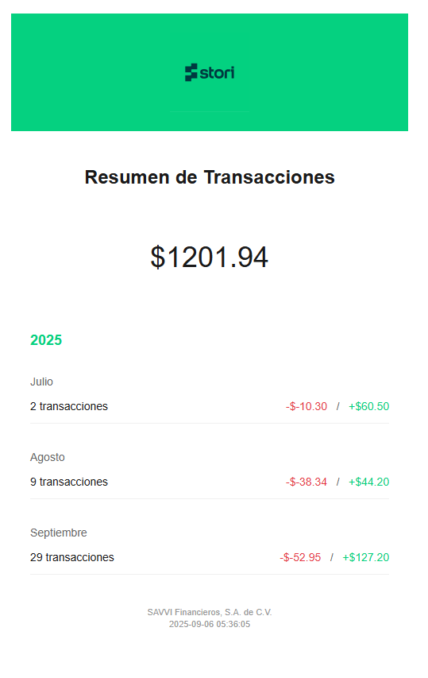
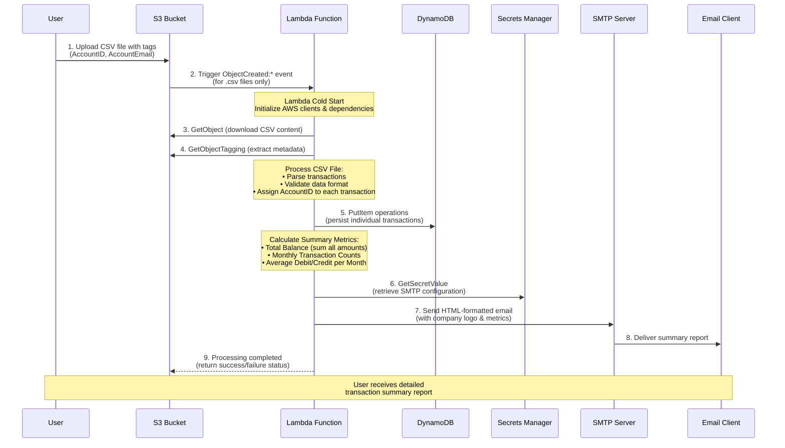

<p align="center">
    
</p>
<h1 align="center">Stori - Transaction Processing System</h1>

[](https://golang.org/)
[](https://aws.amazon.com/lambda/)
[](https://aws.amazon.com/dynamodb/)

#### ⚠️⚠️⚠️⚠️⚠️ IMPORTANT ADVICE ⚠️⚠️⚠️⚠️⚠️

You might wonder why this project is not deployed directly on AWS. The intention is to make the challenge more engaging, anyone can spin up a stack in AWS. While deploying to AWS is straightforward, ensuring that the system runs smoothly on LocalStack and provides a solid local development experience requires more attention.

The project is fully compatible with AWS if you wish to deploy it there. A CloudFormation template is also included for direct deployment to AWS. However, testing on LocalStack is strongly recommended first.

So, just get fun! I want to make it more engaging and show you my DX skills ;)

---

## 📋 Table of Contents

- [📖 Project Overview](#-project-overview)
    - [✨ Key Features](#-key-features)
- [🎯 Challenge Requirements](#-challenge-requirements)
    - [📄 Input Format](#-input-format)
    - [📊 Required Output Metrics](#-required-output-metrics)
    - [✅ Technical Requirements Met](#-technical-requirements-met)
- [🏗️ Solution Architecture](#️-solution-architecture)
    - [✨ Assumptions & Decisions](#-some-assumptions--decisions)
- [🛠️ Technology Stack](#️-technology-stack)
    - [Backend & Runtime](#backend--runtime)
    - [Storage & Database](#storage--database)
    - [Infrastructure & DevOps](#infrastructure--devops)
    - [Monitoring & Logging](#monitoring--logging)
- [📁 Project Structure](#-project-structure)
    - [🏛️ Architecture Patterns](#️-architecture-patterns)
        - [Domain Layer](#domain-layer-internal)
        - [Application Layer](#application-layer-internalapplication)
        - [Infrastructure Layer](#infrastructure-layer-cmd-pkg)
- [🚀 Getting Started](#-getting-started)
    - [📋 Prerequisites](#-prerequisites)
    - [🐳 Local Development with LocalStack](#-local-development-with-localstack)
    - [📋 Available Tasks](#-available-tasks)
- [⚙️ Configuration](#️-configuration)
    - [🔒 Required Secrets (AWS Secrets Manager)](#-required-secrets-aws-secrets-manager)
    - [🌍 Environment Variables](#-environment-variables)
    - [🏷️ S3 Object Tags (Required)](#️-s3-object-tags-required)
    - [🧪 Testing](#-testing)
- [💡 Proposals for Improvement](#-proposals-for-improvement)

## 📖 Project Overview

This project implements a **serverless, event-driven transaction processing system** that:

- 📁 Processes CSV transaction files uploaded to S3
- 📊 Calculates comprehensive account summaries
- 📧 Sends formatted email reports with transaction insights
- 💾 Persists data in DynamoDB for audit and historical analysis
- 🔒 Manages sensitive data securely using AWS Secrets Manager

### ✨ Key Features

- **Event-Driven Architecture**: Automatic processing triggered by S3 uploads
- **Serverless Computing**: Zero-maintenance infrastructure with AWS Lambda
- **Scalable Storage**: DynamoDB for high-performance data persistence
- **Secure Configuration**: Encrypted secrets management
- **Local Development**: Complete LocalStack integration for offline development

## 🎯 Challenge Requirements

### 📄 Input Format

The system processes CSV files with the following structure:

```csv
Id,Date,Transaction
1,1/1,-150
2,1/3,+900.5
3,1/15,+99.5
4,1/20,-50
5,8/2,-30
6,8/13,-30
7,8/13,-30
8,8/2,+50
9,8/13,+30
10,8/13,+10.3
11,5/13,+10.3
```

**Transaction Format Rules:**
- ✅ **Credit transactions**: Positive values (e.g., `+900.5`)
- ❌ **Debit transactions**: Negative values (e.g., `-150`)
- 📅 **Date format**: M/D or MM/DD format

### 📊 Required Output Metrics

The system generates the following summary metrics:

| Metric                        | Description                             | Example                 |
| ----------------------------- | --------------------------------------- | ----------------------- |
| **Total Balance**             | Sum of all transactions                 | `$799.74`               |
| **Monthly Transaction Count** | Number of transactions per month        | `January: 4, August: 6` |
| **Average Debit Amount**      | Mean of negative transactions per month | `-$40.00`               |
| **Average Credit Amount**     | Mean of positive transactions per month | `$250.08`               |

**Example Email Report Output** (based on sample CSV file):

```
📊 Account Transaction Summary

Total Balance: $799.74
Number of transactions in January: 4
Number of transactions in August: 6
Number of transactions in May: 1
Average debit amount: -$52.50
Average credit amount: +$250.08
```

*Note: The actual email is sent in HTML format with styling and the Stori logo.*

**📧 Email Report Example:**

<p align="center">
    
</p>

### ✅ Technical Requirements Met

- [x] **Language**: Implemented in Go (Golang)
- [x] **Containerization**: Docker support with docker-compose
- [x] **Email Delivery**: HTML-formatted emails with company logo
- [x] **Data Persistence**: DynamoDB for transaction storage
- [x] **Cloud Deployment**: AWS Lambda + S3 architecture
- [x] **Infrastructure as Code**: CloudFormation templates
- [x] **Local Development**: LocalStack integration

## 🏗️ Solution Architecture



## ✨ Some assumptions & Decisions

- Since there is no AccountID field in the CSV, it is assumed that the microservice uploading the file to S3 is responsible for adding the `AccountID` and `AccountEmail` tags to the object.
- The system ignores any file that does not have the `.csv` extension.
- As it is not a best practice to store sequential identifiers for transactions, a UUID is generated for each transaction, and the original ID is stored in a separate field.

### ⚠️⚠️⚠️⚠️⚠️ IMPORTANT ADVICE ⚠️⚠️⚠️⚠️⚠️

You might wonder why this project is not deployed directly on AWS. The intention is to make the challenge more engaging, anyone can spin up a stack in AWS. While deploying to AWS is straightforward, ensuring that the system runs smoothly on LocalStack and provides a solid local development experience requires more attention.

The project is fully compatible with AWS if you wish to deploy it there. A CloudFormation template is also included for direct deployment to AWS. However, testing on LocalStack is strongly recommended first.

So, just get fun!

## 🛠️ Technology Stack

### **Backend & Runtime**
- **[Go 1.24.5](https://golang.org/)** - High-performance, statically typed language
- **[AWS Lambda](https://aws.amazon.com/lambda/)** - Serverless compute platform
- **[AWS SDK for Go v2](https://aws.amazon.com/sdk-for-go/)** - AWS service integrations

### **Storage & Database**
- **[Amazon S3](https://aws.amazon.com/s3/)** - Object storage for CSV files
- **[Amazon DynamoDB](https://aws.amazon.com/dynamodb/)** - NoSQL database for transactions
- **[AWS Secrets Manager](https://aws.amazon.com/secrets-manager/)** - Secure credential storage

### **Infrastructure & DevOps**
- **[AWS CloudFormation](https://aws.amazon.com/cloudformation/)** - Infrastructure as Code
- **[Docker](https://www.docker.com/)** - Containerization
- **[LocalStack](https://localstack.cloud/)** - Local AWS emulation
- **[Taskfile](https://taskfile.dev/)** - Task automation and build orchestration

### **Monitoring & Logging**
- **[Zerolog](https://github.com/rs/zerolog)** - Structured logging

## 📁 Project Structure

```
stori-challenge/
├── 📁 cmd/
│   └── lambda/                    # Lambda entrypoint
│       └── main.go                # AWS Lambda handler
├── 📁 internal/
│   ├── application/              # Application layer
│   │   ├── application_config.go # Configuration management
│   │   ├── env_provider.go       # Environment variables
│   │   ├── secrets_provider.go   # AWS Secrets integration
│   │   └── transaction_processor.go # Core business logic
│   ├── summaries/                # Summary calculation domain
│   │   ├── s3_summary_files_storage.go # S3 file operations
│   │   ├── summarizer.go         # Summary calculations
│   │   ├── summary.go            # Summary data structures
│   │   └── mailing/              # Email delivery
│   │       ├── email_template.html # HTML email template
│   │       ├── mailer.go         # Email interface
│   │       └── smtp_mailer.go    # SMTP implementation
│   └── transactions/             # Transaction domain
│       ├── csv_transaction_loader.go # CSV parsing
│       ├── dynamo_transactions_repository.go # DynamoDB operations
│       ├── transaction.go        # Transaction model
│       └── transactions_repository.go # Repository interface
├── 📁 pkg/
│   └── blend/                    # Shared utilities
│       ├── logger.go             # Logging interface
│       └── zerolog.go            # Zerolog implementation
├── 📁 infrastructure/
│   └── cloudformation/
│       └── localstack.yaml       # AWS infrastructure template
├── 📁 data/                      # Sample data files
├── 📁 scripts/                   # Automation scripts
├── docker-compose.yml            # Local development environment
├── Taskfile.yml                  # Task automation
└── README.md                     # This documentation
```

### 🏛️ Architecture Patterns

The solution follows **Clean Architecture** principles with clear separation of concerns:

#### **Domain Layer** (`internal/`)
- **Transactions**: Core business entities and repository patterns
- **Summaries**: Summary calculation logic and storage abstractions

#### **Application Layer** (`internal/application/`)
- **Configuration Management**: Environment and secrets provider interfaces
- **Transaction Processor**: Main business workflow orchestrator

#### **Infrastructure Layer** (`cmd/`, `pkg/`)
- **Lambda Handler**: AWS Lambda integration point
- **Utilities**: Shared logging and utility functions

## 🚀 Getting Started

### 📋 Prerequisites

Before you begin, ensure you have the following installed:

- **[Go 1.24.5](https://golang.org/dl/)** - Programming language runtime
- **[Docker](https://docs.docker.com/get-docker/)** - Container platform
- **[Docker Compose](https://docs.docker.com/compose/install/)** - Multi-container orchestration
- **[Task](https://taskfile.dev/installation/)** - Task automation tool
- **[AWS CLI](https://aws.amazon.com/cli/)** (optional) - For AWS deployment

### 🐳 Local Development with LocalStack

#### ⚠️⚠️⚠️⚠️⚠️ IMPORTANT ADVICE ⚠️⚠️⚠️⚠️⚠️

You might wonder why this project is not deployed directly on AWS. The intention is to make the challenge more engaging. While deploying to AWS is straightforward, ensuring that the system runs smoothly on LocalStack and provides a solid local development experience requires more attention.

The project is fully compatible with AWS if you wish to deploy it there. A CloudFormation template is also included for direct deployment to AWS. However, testing on LocalStack is strongly recommended first.

So, just get fun!

1. **Clone the repository (yep)**

2. **Configure the secrets**
    Create a file named `localstack-secrets-example.json` in the project root with the following content:

    ```json
    {
        "SMTP_HOST": "smtp.gmail.com",
        "SMTP_PORT": "587",
        "SMTP_USERNAME": "your_mail@gmail.com",
        "SMTP_PASSWORD": "your_password",
        "SMTP_FROM": "your_mail@gmail.com"
    }
    ```
    > Don't worry, I'll send you some credentials in the response mail.

3. **Start the local emulator (Yes, this is enough)**
    ```bash
    task setup
    ```

4. **Just test it!**}
    This is going to upload a sample CSV file to the local S3 bucket with the required tags:
    ```bash
    task s3:upload FILE=data/transactions.csv ACCOUNT_ID=ACC001 EMAIL=user@example.com
    task s3:upload FILE=data/transactions_multiyear.csv ACCOUNT_ID=ACC001 EMAIL=user@example.com
    ```

5. **Check the lambda logs**
    ```bash
    task lambda:logs
    ```

6. **Check the DynamoDB table content**
    ```bash
    task db:list
    ```

### 📋 Available Tasks

The project includes a comprehensive set of tasks to streamline development and testing. Here's a complete reference:

| **Task**             | **Description**                                                               | **Main Actions**                                                                    |
| -------------------- | ----------------------------------------------------------------------------- | ----------------------------------------------------------------------------------- |
| **test**             | Runs all Go unit tests.                                                       | Executes `go test -v ./...`                                                         |
| **setup**            | Starts the full environment (containers + Lambda + CloudFormation).           | Restarts Docker, deploys infrastructure, completes environment setup.               |
| **deploy**           | Builds the Lambda, uploads the package to S3, and deploys via CloudFormation. | Clears old stack, compiles Lambda, uploads to S3, creates stack, populates secrets. |
| **down**             | Stops all running containers.                                                 | Runs `docker-compose down`.                                                         |
| **clean**            | Cleans up the environment, similar to `down`.                                 | Stops containers and confirms cleanup.                                              |
| **docker:restart**   | Restarts Docker containers using `docker-compose`.                            | Stops containers, restarts them with `--wait`.                                      |
| **terminal**         | Opens an interactive shell in the terminal container.                         | `docker exec -it {{.TERMINAL_CONTAINER}} sh`                                        |
| **logs:localstack**  | Streams LocalStack logs in real time.                                         | Executes `docker logs -f {{.LOCALSTACK_CONTAINER}}`.                                |
| **lambda:build**     | Builds the Go Lambda and packages it into a `.zip`.                           | Uses Go Docker image, compiles binary, strips, zips, moves to workspace.            |
| **lambda:logs**      | Shows Lambda execution logs from LocalStack.                                  | Runs `aws logs filter-log-events` in the log group.                                 |
| **cf:clear**         | Deletes the CloudFormation stack if it exists.                                | Executes `aws cloudformation delete-stack`.                                         |
| **cf:deploy**        | Deploys the CloudFormation stack into LocalStack.                             | Copies Lambda zip, ensures S3 bucket, uploads package, creates stack.               |
| **s3:upload**        | Uploads a CSV file to S3 with account and email tags.                         | Validates parameters, copies file, executes `s3api put-object` with tags.           |
| **s3:list**          | Lists objects in the S3 transactions bucket with metadata.                    | Runs `aws s3api list-objects-v2` to show key, date, size.                           |
| **secrets:populate** | Populates AWS Secrets Manager with values from a JSON file.                   | Executes `/scripts/populate-secrets.sh`.                                            |
| **secrets:list**     | Lists all secrets and their values in JSON format.                            | Iterates through Secrets Manager and prints `{name, value}`.                        |
| **db:list**          | Lists all records from the DynamoDB transactions table.                       | Executes `aws dynamodb scan` on `stori-challenge-transactions`.                     |

## ⚙️ Configuration

### 🔒 Required Secrets (AWS Secrets Manager)

| Secret Name     | Description                  | Example Value          |
| --------------- | ---------------------------- | ---------------------- |
| `SMTP_HOST`     | SMTP server hostname         | `smtp.gmail.com`       |
| `SMTP_PORT`     | SMTP server port             | `587`                  |
| `SMTP_USERNAME` | SMTP authentication username | `your-email@gmail.com` |
| `SMTP_PASSWORD` | SMTP authentication password | `your-app-password`    |
| `SMTP_FROM`     | Email sender address         | `noreply@stori.com`    |

### 🌍 Environment Variables

| Variable              | Description         | Default        |
| --------------------- | ------------------- | -------------- |
| `DYNAMODB_TABLE_NAME` | DynamoDB table name | Auto-generated |
| `AWS_REGION`          | AWS region          | `us-east-1`    |
| `LOG_LEVEL`           | Logging level       | `info`         |

### 🏷️ S3 Object Tags (Required)

When uploading CSV files to S3, the following tags **must** be present:

- **`AccountID`**: Unique identifier for the account (e.g., `ACC123`)
- **`AccountEmail`**: Email address to send the summary report (e.g., `user@example.com`)

### 🧪 Testing

```bash
# Run unit tests
task test
```

## 💡 Proposals for Improvement

While the system meets all the current challenge requirements, several enhancements could further strengthen scalability, security, and developer experience:

1. **📈 Enhanced Observability**

   * Integrate distributed tracing (e.g., AWS X-Ray) to track Lambda execution paths.
   * Provide structured metrics (e.g., via CloudWatch dashboards or Prometheus/Grafana) to monitor system health.

2. **🔐 Stronger Security**

   * Implement IAM least-privilege roles for Lambda and service integrations.
   * Rotate SMTP credentials automatically with AWS Secrets Manager rotation policies.

3. **🗂️ Data Model Optimization**

   * Extend the DynamoDB schema to include secondary indexes (e.g., by AccountID + Month) to speed up queries.
   * Add support for multi-account batch reports.

4. **📤 Multi-Channel Notifications**

   * Provide alternative delivery channels (e.g., SMS, Slack, or Webhooks) in addition to email.
   * Introduce a notification service interface to support future expansion.

5. **🧪 Testing & Quality**

   * Expand integration testing against LocalStack with more edge cases (e.g., malformed CSVs, missing tags).
   * Add contract tests for email templates to validate rendering consistency.

6. **⚡ Performance Improvements**

   * Batch DynamoDB writes to reduce request overhead.
   * Consider asynchronous processing with SQS/SNS to decouple ingestion from summarization.

7. **🌍 Internationalization**

   * Support multi-language email templates (e.g., English/Spanish) driven by metadata.
   * Allow currency formatting based on account region.

8. **🧑‍💻 Developer Experience**

   * Provide a CLI utility for uploading test CSVs and triggering Lambdas locally.
   * Improve Taskfile automation with additional shortcuts for testing and deployment.

---

<p align="center">
  <strong>Built with ❤️ by the future member of the Stori Team</strong>
</p>
